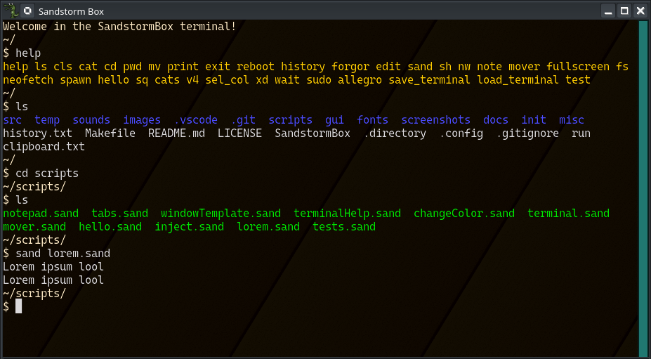
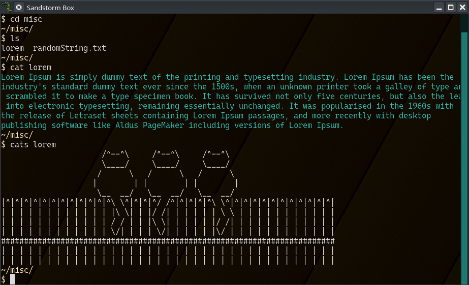
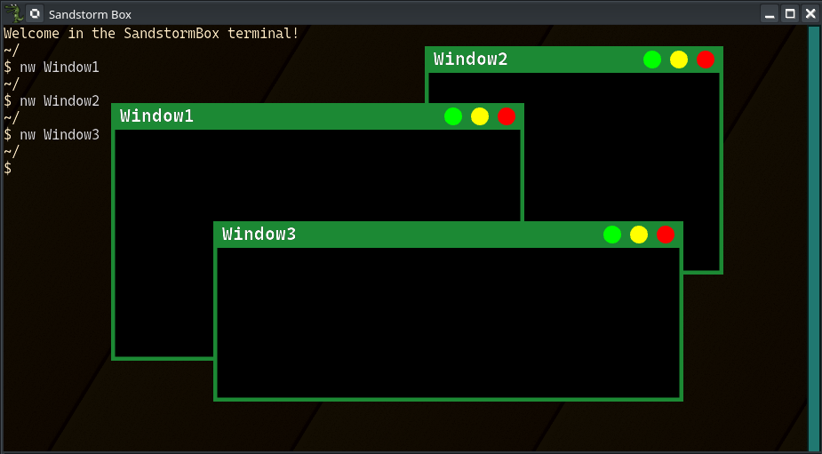
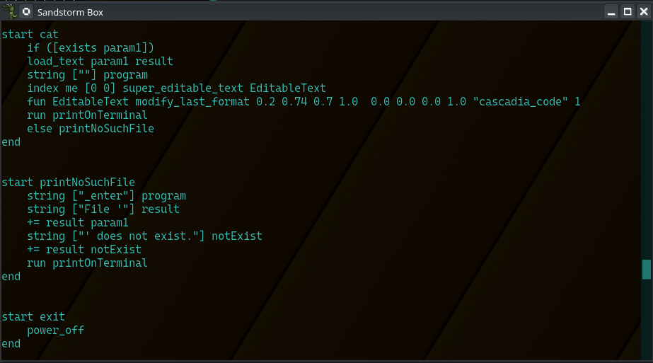

# SandstormBox
Graphical Engine / 2D Game Engine written in c++ and Allegro5 graphical library.

This engine uses Sand - a custom scripting language made out of the engine's instructions. You can find all implemented instructions in the /docs/instructions.md file. To learn about this language read the /docs/language.md file. All programs and utilities that work inside the engine are written in the Sand language.

## Implemented functionality

Below are the most important working parts of the engine: 
- JIT Compilation - all the software inside the engine is currently compiled from the scripts. You can also compile scripts inside the terminal using "sand" compilator.
- Terminal - you can use many commands like "ls" (list files in the directory), "edit" (text editor), "sand" (execute Sand scripts) or "cat" (print out the contents of the file on the terminal).
- Text editor - is built into the terminal and can be opened with "edit" command. With this editor you can edit any text files and save them. You can also select multiple letters, words and lines in the text with the keyboard or mouse. Text inside the editor is wrapped automatically.
- Mover - a program that lets you move around the objects inside the chosen layer. 
- Scrollbars - programs that use scrollbars let you scroll through their contents with the mouse - both with the wheel and by dragging the scrollbar.
- Windows - you can create, move, resize, fullscreen and close them. Command "nw" creates a blank window and its first parameter is used as a title of this window.

Use 'help' command inside the terminal or press the TAB key to list all the available programs.

## Screenshots from the engine

Terminal with help, ls, cd and sand:
 

 
Cat programs:
 

 
Windows:
 

 
Text editor:
 

## Scripts

Currently, if you execute the engine binary without any scripts, you will get only a black screen. Directories "init" and "scripts" have necessary scripts for creating the terminal.

## Command line arguments

    -i, --interpreter
        Start the interpreter.

    -c, --ignore-config
        Ignore .config file.

    -s, --samples
        Set the number of samples used in antialiasing. Maximal recommended number of samples is 8. If sampling is not supported on your machine, you must set this value to 0.

    -p, --pixel-art
        Disable the pixel blur while drawing bitmaps.

    -f, --fullscreen
        Go to fullscreen mode when a window is created.

    -n, --not-ascii
        Allow use of other character encodings.

## Config file

EXECUTE script_path - executes the script in a new process - on boot and restart.

SAMPLES X - sets the number of samples used in antialiasing. Maximal recommended number of samples is 8. If sampling is not supported on your machine, you must set this value to 0.

ENABLE_al_set_clipboard_text - al_set_clipboard_text can cause undefined behavior on some linux configurations so it's disabled by default. When enabled, allows to copy text from the engine to the clipboard of the host OS.

ENABLE_NOT_ASCII - allows using characters other than ASCII.

## Allegro5

To install allegro go here: https://github.com/liballeg/allegro_wiki/wiki/Quickstart.

## Build

To build and use the SandstormBox engine you need the Allegro5 library and the Make program.

After meeting this condition you can build the engine with:

    make

Alternatively you can use Visual Studio Code to compile the engine with the CTRL+SHIFT+B shortcut and clicking "Compile Engine".

## Troubleshooting

- If the text has a glitched font, you can change the antialiasing samples to 1 in the .config file.