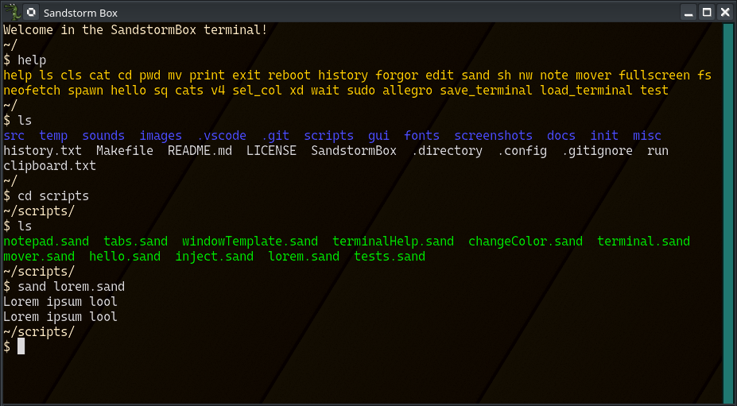
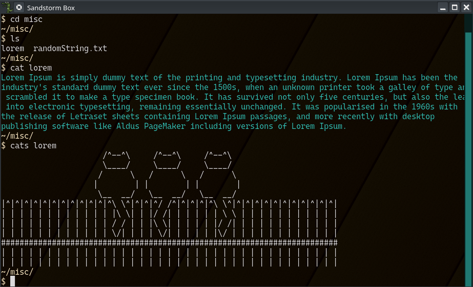
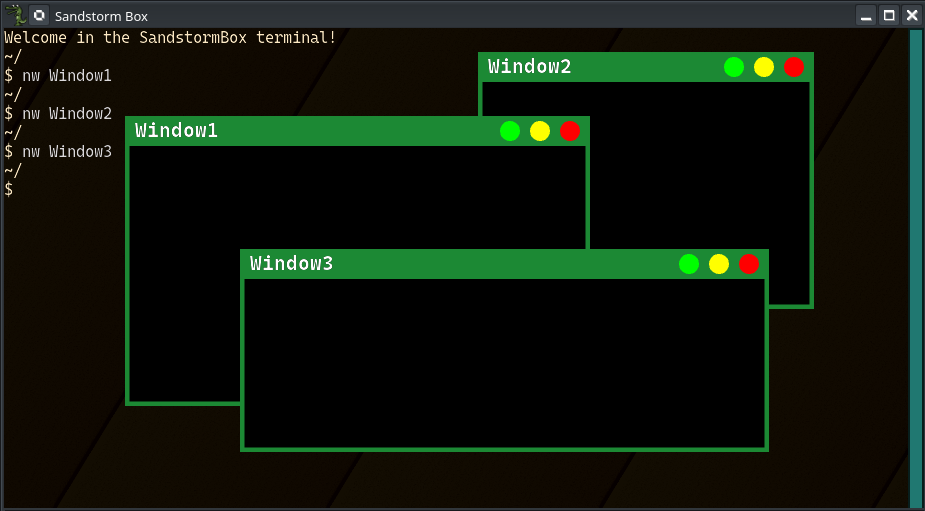
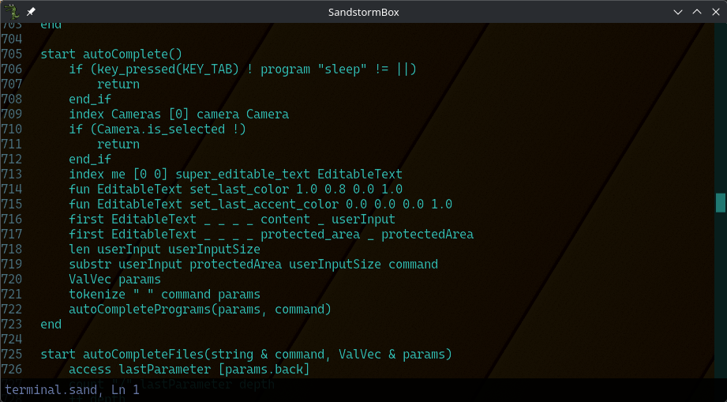

# SandstormBox
Graphical Engine / 2D Game Engine written in c++ and Allegro5 graphical library.

It's my hobby project and will not be "production ready" any time soon. And if it ever gets finished its use will be purely recreational - I hope.

SandstormBox engine uses Sand - it's my custom scripting language closely integrated into the engine. You can find all implemented instructions in the /docs/instructions.md file. To learn more about Sand read the /docs/language.md file (it's probably outdated tho). All programs and utilities that work inside the engine are written in the Sand language.

## Implemented functionality

Below are the most important implemented parts of the engine: 
- Script-to-Event Execution Pipeline - engine can compile and run scripts during the runtime. By default engine grabs initial scripts from the config file, but you can also pass your scripts as the command line arguments. 
- Terminal - you can use commands like "ls" (list files in the directory), "edit" (simple text editor), "sand" (compile & run Sand scripts) or "cat" (output file contents to the terminal).
- Text editor - it's built into the terminal and can be opened with "edit" command. With this editor you can edit any text files and save them. You can also select multiple letters, words and lines in the text with the keyboard or mouse. Text inside the editor is wrapped automatically - all text fields have this feature implemented.
- Mover - program that lets you move around all objects inside the chosen layer. 
- Scrollbars - you can scroll horizontally and vertically through the layer by using mouse - both with the mouse wheel and by dragging the scrollbar.
- Windows - you can create, move, resize, fullscreen and close them. Command "nw" creates a blank window and its first parameter is used as a title for the new window.

Use 'help' command inside the terminal or press the TAB key to list all the available programs.

## Screenshots from the engine

Terminal with help, ls, cd and sand:
 

 
Cat programs:
 

 
Windows:
 

 
Text editor:
 

## Scripts

Currently, if you compile and run SandstormBox without any scripts as an input, engine will only output source code for a hello world program. You can test the engine by passing to it any Sand script from "examples" and "scripts" directories. For example, to use my terminal run:

    ./SandstormBox scripts/terminal/init.sand

## Tests

After compiling SandstormBox Make will automatically run tests written in Sand. You can also run them manually by using "make test" or by passing any test script from the "scripts" directory to the engine.

## Command line arguments

    -i, --interpreter
        Start a very simple interpreter.

    -c, --ignore-config
        Ignore .config file. By default engine will always search for .config file on startup and if this file exists engine will execute its commands.

    -s, --samples
        Set the number of samples used in antialiasing. Maximal recommended number of samples is 8. If sampling is not supported on your machine, set it to 0.

    -p, --pixel-art
        Disable "pixel blur" while drawing bitmaps.

    -f, --fullscreen
        Go to fullscreen mode when window is created.

    -n, --not-ascii
        Allow the use of other character encodings. Although they can be displayed, interacting with them will cause undefined behavior.

    --mouse-text-skip
        Set the number of skipped iterations when selecting text using mouse. Number cannot be lower than 1. It's a workaround for increasing performance when working with long text files.

## Config file

Following commands can be used only in ".config" file:

    EXECUTE script_path - execute one script in a new in-engine process every time engine is called or restarted at its runtime. EXECUTE command can be used as many times as needed to run multiple scripts one after the other.

    SAMPLES *number* - set the number of samples used in antialiasing. Maximal recommended number of samples is 8. If sampling is not supported on your machine, you must set this value to 0.

    ENABLE_al_set_clipboard_text - al_set_clipboard_text can cause undefined behavior on some linux configurations so it's disabled by default. When enabled, allows to copy text from the engine to the clipboard of the host OS.

    ENABLE_NOT_ASCII - allow using characters other than ASCII.

    MOUSE_TEXT_SKIP *number* - set the number of skipped iterations when mouse is selecting the text. Number cannot be lower than 1.

Engine will execute these commands only on startup before its main loop. Keep in mind you can still execute new scripts at runtime.

## Allegro5

To install allegro5 go here: https://github.com/liballeg/allegro_wiki/wiki/Quickstart.

## Build

To build and use the SandstormBox engine you need the Allegro5 library and the Make program.

After meeting these conditions you can build the engine with:

    make

Alternatively (less cooler approach) you can use Visual Studio Code to compile the engine with the CTRL+SHIFT+B shortcut and clicking "Compile Engine".

## Troubleshooting

- If the rendered text has a glitched font, you can change the antialiasing samples to 1 in the .config file.
